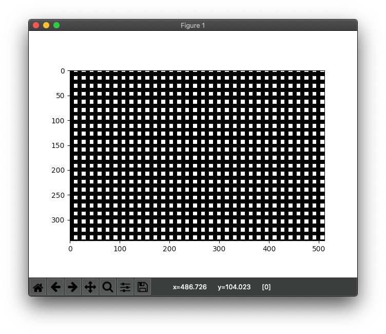
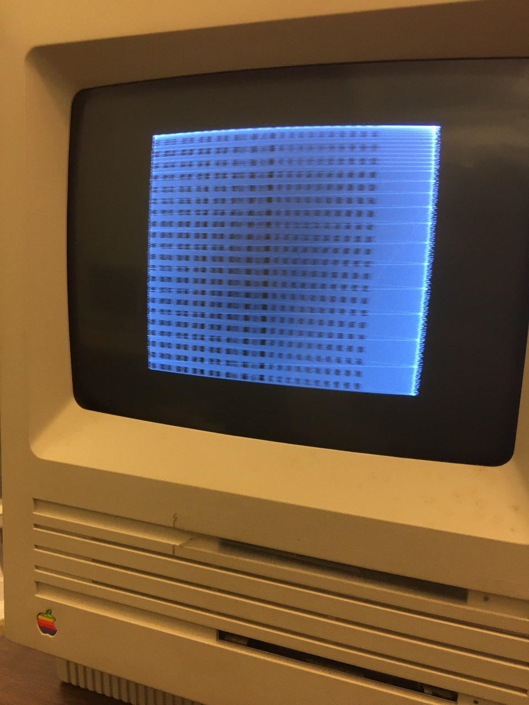
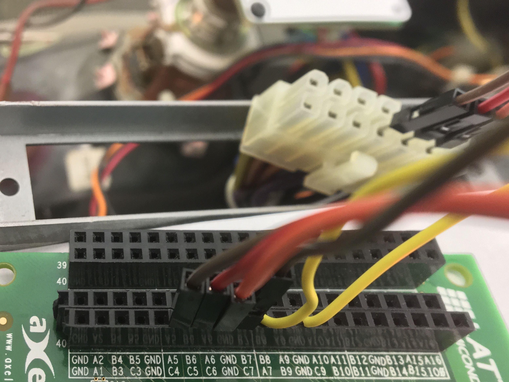

## nMigen MacSE FPGA display Controller
A new and improved FPGA display controller compared to [this].

**Simulation Image**


**Actual Image**

Due to the limitations of the Lattice Hx8k, I was only able
to achieve a clock of 15.55MHz instead of 15.672MHz as specified,
with a 45/55 duty cycle.

This may be why the images don't match up.

I will later pull out my logic analyzer and inspect the 
signals from the MacSE motherboard directly to confirm.

## Dependencies
 * [nMigen](https://github.com/m-labs/nmigen)
 * [yosys](https://github.com/YosysHQ/yosys)
 * [IceStorm](https://github.com/cliffordwolf/icestorm)
 * [arachne-pnr](https://github.com/YosysHQ/arachne-pnr)
 * matplotlib - ``pip3 install matplotlib``
 * numpy - ``pip3 install numpy``

## Hooking Up the FPGA to the MacSE
You'll need to locate the other end of the 14-pin MOLEX 
connector that plugs into the vertical power board of
the MacSE, and connect your Lattice iceHX8k to those pins.

In the file ``src/top.pcf``, the following pins are 
used.

```
set_io VSYNC A5
set_io HSYNC B6
set_io VIDEO A6
set_io clk J3
set_io rst B7
```

You can find the MOLEX pinout for the MacSE
[here](https://yehowshuaimmanuel.com/Vintage_Tech/retrotech/power_pinout.png).

I physically connect pin B7(rst) to a GND pin on the FPGA as shown below.


## Modifying the controller

You can easily modify the controller to read your text roms
or images from an external SRAM.
In ``src/CRT.py`` you'll find the variables
 * ``valid``
 * ``active_col``
 * ``active_row``
 * ``self.VIDEO``

The resolution of the MacSE screen is 512x342.
To display what you want on the screen, you'll need to provide
the correct value(either 1 or 0 given that MacSE has a two-tone display)
to ``self.VIDEO`` when ``self.valid`` is high.

You'll also need to know the current position of the CRT beam
which is given by ``active_row`` and ``active_col``.

## Programming the Lattice IceHX8K
Change into ``src/`` and run ``$make prog``.

## Generating standalone verilog for the CRT driver
Change into ``src/`` and run ``$python3 generate.py``

## Simulating and viewing display with matplotlib
Change into ``src/`` and run ``python3 crt.py simulate --write_VCD=False``.


[this]:https://github.com/BracketMaster/MacSE_CRT_Controller_Test